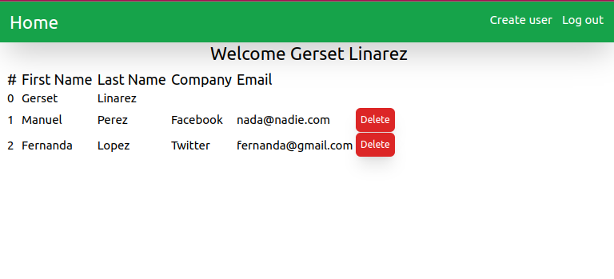

# Prueba tecnica

Esta es una aplicacion web en donde puedes crear y eliminar usuarios, el usuario por defecto es `admin` y la contraseña es `admin`. Esta hecho en ReactJS y TailwindCSS y usa localStorage.

## Instalacion

1. Requisitos: NodeJS
2. Descargar el codigo
3. En una terminal, situado en el directorio raiz del codigo, hacer `npm install` para instalar los modulos
4. En la terminal, poner `npm run dev` para correr el servidor de desarrollo y acceder al sitio de forma local en el puerto que indique la terminal

## Screnshots

